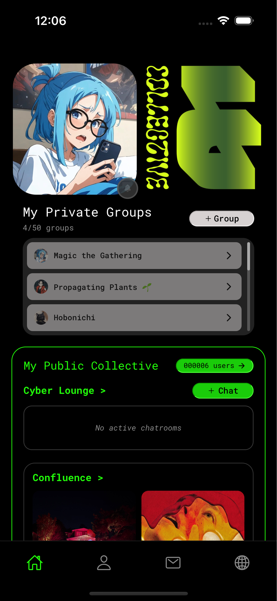
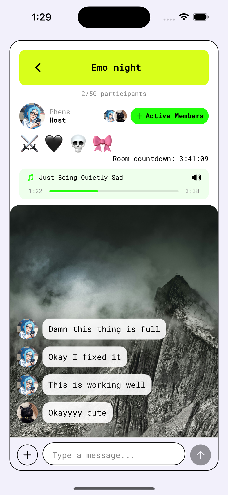
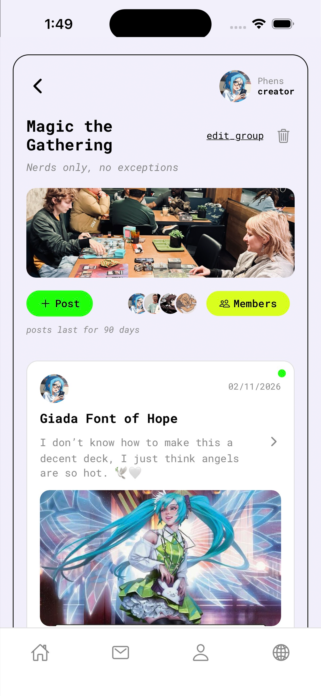

# Collective App

[](https://opensource.org/licenses/MIT)
[](https://expo.dev)
[](https://reactnative.dev)

A community-focused mobile application built with React Native/Expo that enables users to connect through groups, events, mutual aid, and real-time conversations.

## Features

- **User Authentication** - Secure sign-up/login with Firebase
- **Groups** - Create and join interest-based group message boards
- **Real-time Chat** - Direct messaging
- **Events** - Create and discover community events within the collective network
- **Mutual Aid** - Share resources and support within the collective network
- **Cyber Lounge** - Ephemeral audio/video rooms for real-time hangouts with ambient music
- **Barter Market** - Trade goods and services within the collective network
- **Confluence** - Art & Culture anonymous archive within the collective network
- **Data Privacy & Deletion** - Automatic data expiration across the platform, preserving only Confluence and Mutual Aid records
- **Open Source** - Designed to be self-hosted, forked for private networks, or adapted to mesh and decentralized infrastructure

## Screenshots





## Getting Started

### Prerequisites

- Node.js (v18 or newer)
- npm or yarn
- iOS development requires Xcode and CocoaPods

### Installation

1. Clone the repository
   ```bash
   git clone https://github.com/Darkstarcyb3r/collectiveApp.git
   cd collectiveApp
   ```

2. Install dependencies
   ```bash
   npm install
   ```

3. Set up environment variables
   ```bash
   cp .env.example .env
   cp functions/.env.example functions/.env
   ```
   Edit both `.env` files with your own keys.

4. Firebase setup
   1. Create a Firebase project at [firebase.google.com](https://firebase.google.com)
   2. Enable Authentication, Firestore, and Storage
   3. Copy your Firebase config values into `.env`
   4. Deploy Firestore rules:
      ```bash
      firebase deploy --only firestore:rules
      ```

5. Cloud storage setup

   Set up Cloudinary (or your preferred image hosting) and add your API keys to `functions/.env`.

### Environment Variables

**Root `.env`** (client-side, Expo):
```
EXPO_PUBLIC_GOOGLE_PLACES_API_KEY=your-google-places-key
EXPO_PUBLIC_FIREBASE_API_KEY=your-firebase-api-key
EXPO_PUBLIC_FIREBASE_AUTH_DOMAIN=your-project.firebaseapp.com
EXPO_PUBLIC_FIREBASE_PROJECT_ID=your-project-id
EXPO_PUBLIC_FIREBASE_STORAGE_BUCKET=your-project.firebasestorage.app
EXPO_PUBLIC_FIREBASE_MESSAGING_SENDER_ID=your-sender-id
EXPO_PUBLIC_FIREBASE_APP_ID=your-app-id
EXPO_PUBLIC_FIREBASE_MEASUREMENT_ID=your-measurement-id
```

**`functions/.env`** (server-side, Cloud Functions):
```
CLOUDINARY_CLOUD_NAME=your-cloud-name
CLOUDINARY_API_KEY=your-cloudinary-key
CLOUDINARY_API_SECRET=your-cloudinary-secret
```

## Project Structure

```
collectiveApp/
├── ios/                  # iOS native files
├── functions/            # Firebase Cloud Functions
├── src/
│   ├── assets/           # Images, fonts
│   ├── audio/            # Background music tracks (Cyber Lounge vibes)
│   ├── components/       # Reusable UI components
│   ├── config/           # Firebase, Cloudinary, vibes config
│   ├── contexts/         # React contexts (Auth, etc.)
│   ├── navigation/       # React Navigation setup
│   ├── screens/          # App screens
│   ├── services/         # Firebase/API service layers
│   ├── theme/            # Colors, typography, spacing
│   └── utils/            # Helper functions
├── assets/               # Root assets (fonts, screenshots, placeholders)
├── App.js                # Main app entry
├── app.json              # Expo configuration
├── firestore.rules       # Firestore security rules
└── package.json          # Dependencies
```

## Built With

- [React Native](https://reactnative.dev) - Mobile framework
- [Expo](https://expo.dev) - Development platform
- [Firebase](https://firebase.google.com) - Backend services and authentication
- [Cloudinary](https://cloudinary.com) - Media management

## Contributing

Contributions are welcome. Whether it's a bug fix, feature idea, or documentation improvement, all skill levels are encouraged to participate.

1. Fork the project
2. Create your feature branch (`git checkout -b feature/YourFeature`)
3. Commit your changes (`git commit -m 'Add this feature'`)
4. Push to the branch (`git push origin feature/YourFeature`)
5. Open a Pull Request

## License

This project is licensed under the MIT License - see the [LICENSE](LICENSE) file for details.

## Attribution

See [ATTRIBUTION.md](ATTRIBUTION.md) for credits on third-party audio and image assets.

- **Audio:** All background music tracks are royalty-free from [Pixabay](https://pixabay.com/music/) see ATTRIBUTION.md for credit 
- **Images:** Placeholder images from [Unsplash](https://unsplash.com/) see ATTRIBUTION.md for credit 

## Contact

collective.app@proton.me
Project link: [github.com/Darkstarcyb3r/collectiveApp](https://github.com/Darkstarcyb3r/collectiveApp)

## Acknowledgments

Built for communities that value autonomy, privacy, and mutual support.
